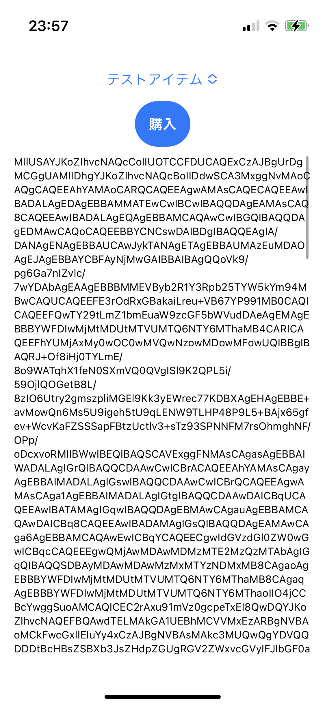

# iOSPayment

iOSのIAPにおいて、他アプリのレシートと入れ替えると通ってしまうという脆弱性が存在する。
このアプリは、簡単にレシートを取得できるアプリなので、アプリのIAPのレシート偽装の脆弱性の診断に便利です。
対策は、ちゃんとレシートの発行先アプリ名を確認することです。

## 使い方

1. `App Store Connect` にログインして、アプリを登録する（アプリIDを `com.funa.iospayment` とする)
2. `App Store Connect` の商品で、攻撃対象のアプリで販売されているアイテムと同じ製品IDのアイテムを作成する
    1. 例： `powerup.item.100`
3. `App Store Connect` にてSandboxテスターアカウントを登録する 
4. 本アプリの `[Target]->[Signing & Capabilities]->[Bundle Identifier]` を `com.funa.iospayment` とする
5. 本アプリの `iospayment/StoreManager.swift` の `productIdentifiers` 配列に、先ほど `App Store Connect` で登録した製品ID(`powerup.item.100`)を追記する。
6. Xcodeでプロジェクトを開きビルドし、スマホで実行する
7. アプリのリストボックスから先ほど登録した商品名を選択し、購入ボタンをタップする。すると、Sandboxテスターアカウントを聞かれるので、アカウント名とパスワードを入力する。
8. 購入が成功するとアプリ画面にレシートが表示される。レシートはログにも出力されているので、PCに取り込みたい時はXcodeのコンソールから取得する

